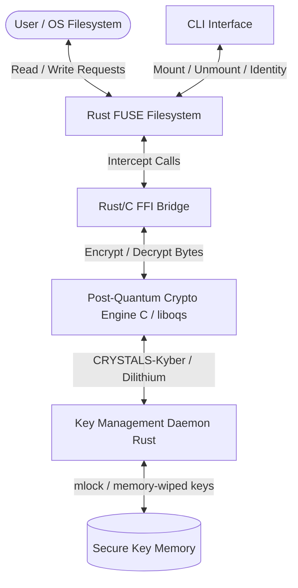

# QuantumVault 🛡️🔒

### Post-Quantum Cryptography (PQC) Local Filesystem

QuantumVault is a transparent, secure virtual filesystem utilizing FUSE (Filesystem in Userspace) and NIST-approved post-quantum cryptographic (PQC) algorithms. It is designed to safeguard highly sensitive data from the emerging threat of **"Harvest Now, Decrypt Later" (HNDL)**, where adversaries intercept and store encrypted data today to decrypt it later once cryptographically viable quantum computers (utilizing Shor's Algorithm) emerge.

---

## 🚀 Key Features

- **Transparent Encryption & Decryption**: Automatic, on-the-fly interception of file read/write operations via a virtual mount point.
- **Lattice-Based Cryptography**: Integrates **CRYSTALS-Kyber** for Key Encapsulation Mechanism (KEM) and **CRYSTALS-Dilithium** for digital signatures (tamper evidence).
- **Memory-Safe Virtual Filesystem**: Core filesystem built in **Rust** using the **FUSE** framework, providing memory safety and low-level performance.
- **C/Rust FFI Bridge**: High-performance bindings connecting the Rust filesystem with the C-based **Open Quantum Safe (liboqs)** library.
- **Secure Key Daemon**: Secure key management daemon using strict memory protection mechanisms (`mlock` and `explicit_bzero` / memory zeroization) to prevent key material from being written to swap space.
- **Native Command Line Interface (CLI)**: A robust CLI tool to mount/unmount vaults, generate post-quantum identities, and manage credentials.

---

## 🏗️ Architecture Design



---

## 🛠️ Technology Stack

- **Low-Level Cryptography**: C, `liboqs` (Open Quantum Safe library)
- **Virtual Filesystem**: Rust, `fuser` (FUSE library for Rust)
- **Systems Integration**: Rust-to-C FFI (Foreign Function Interface)
- **Security Primitives**: `libc` (`mlock`, `munlock`, memory pinning)
- **Operating System**: Linux (specifically Ubuntu/Debian or WSL2)

---

## 📅 Week-Wise Development Plan

The project is structured into a 4-week implementation timeline as part of the Infotact Solutions project structure.

| Week | Phase | Cryptography & Key Management (C, liboqs) | Filesystem Integration (Rust, FUSE) |
| :---: | :--- | :--- | :--- |
| **Week 1** | **Foundations** | **PQC Compilation**: Compile `liboqs`. Write a C program to generate CRYSTALS-Kyber keypairs and perform basic encryption/decryption of a byte stream. | **FUSE Foundations**: Bootstrap the Rust project. Set up a basic FUSE interface that mounts a virtual folder and returns stub data (e.g., "Hello World"). |
| **Week 2** | **Integration & Write Path** | **Rust/C FFI Bridge**: Write Rust FFI bindings to safely invoke the underlying C `liboqs` functions. | **Transparent Encryption**: Hook FUSE `write` operations. Intercept the write buffer, pass it to the PQC engine for Kyber encryption, and commit the cipher text to disk. |
| **Week 3** | **Read Path & Signatures** | **Digital Signatures**: Integrate CRYSTALS-Dilithium to digitally sign every file saved in the vault, ensuring tamper-evidence and integrity validation. | **Transparent Decryption**: Hook FUSE `read` operations. Read encrypted chunks from disk, decrypt them in memory, verify the Dilithium signature, and pass plain text to the OS. |
| **Week 4** | **Hardening & CLI** | **Memory Security**: Implement strict memory-wiping procedures (`mlock`/`explicit_bzero`) to ensure unencrypted key materials are never swapped to the hard disk paging file. | **Refine & Polish**: Build the CLI wrapper for the user to initialize the vault, set master passwords, and manage mount states. |

---

## 🔧 Prerequisites & Installation

### System Packages (Linux / WSL2)
Install the required system dependencies for FUSE, CMake, GCC, and Rust:

```bash
# Update package lists
sudo apt update

# Install build essentials, CMake, and FUSE development headers
sudo apt install -y build-essential cmake libfuse3-dev pkg-config git
```

### Install Rust Toolchain
Ensure you have the latest stable Rust compiler installed:

```bash
curl --proto '=https' --tlsv1.2 -sSf https://sh.rustup.rs | sh
source $HOME/.cargo/env
```

### Building `liboqs`
Clone and build the Open Quantum Safe library:

```bash
git clone --depth 1 https://github.com/open-quantum-safe/liboqs.git
cd liboqs
mkdir build && cd build
cmake -GNinja -DOQS_USE_OPENSSL=OFF ..
ninja
sudo ninja install
```

---
## 💻 Getting Started

### 1. Clone the Repository
Clone the project repository to your local machine:

```bash
git clone https://github.com/Mehulbirare/QuantumVault.git
cd QuantumVault
```

### 2. Build QuantumVault
```bash
cargo build --release
```

### 2. Initialize the Vault
Create a directory to store the encrypted data (backend) and a mountpoint where the decrypted filesystem will be accessible:

```bash
mkdir -p ~/vault_secure_backend
mkdir -p ~/quantum_vault_mount
```

Initialize your post-quantum keys and master password:
```bash
./target/release/quantumvault-cli init --backend ~/vault_secure_backend
```

### 3. Mount the Filesystem
Mount the secure vault to the target mountpoint:

```bash
./target/release/quantumvault-cli mount --backend ~/vault_secure_backend --mountpoint ~/quantum_vault_mount
```
Now, any file dropped into `~/quantum_vault_mount` will be automatically encrypted with CRYSTALS-Kyber and signed with CRYSTALS-Dilithium before being saved to `~/vault_secure_backend`.

### 4. Unmount the Vault
To securely unmount and lock the vault:

```bash
fusermount -u ~/quantum_vault_mount
```

---

## 🤝 Project Rules & Git Compliance

As per the **Infotact Solutions Standard Operating Procedures (SOP)**:
- **Branch Strategy**: Each developer must work on their dedicated branch (e.g. `member-A`, `member-B`). Solo contributors are permitted to commit directly to `main`.
- **Commit Discipline**: Direct contributions must consist of valid commits (code updates, documentation, configuration changes). Commit frequency is monitored daily via the tracking dashboard.
- **Mid Review Criteria**: Focuses on Week 1 & 2 deliverables (PQC compilation, basic FUSE mounting, and FFI bridge).
- **Final Review Criteria**: Full implementation validation (transparent read/write, Dilithium signatures, memory hardening, and CLI).
