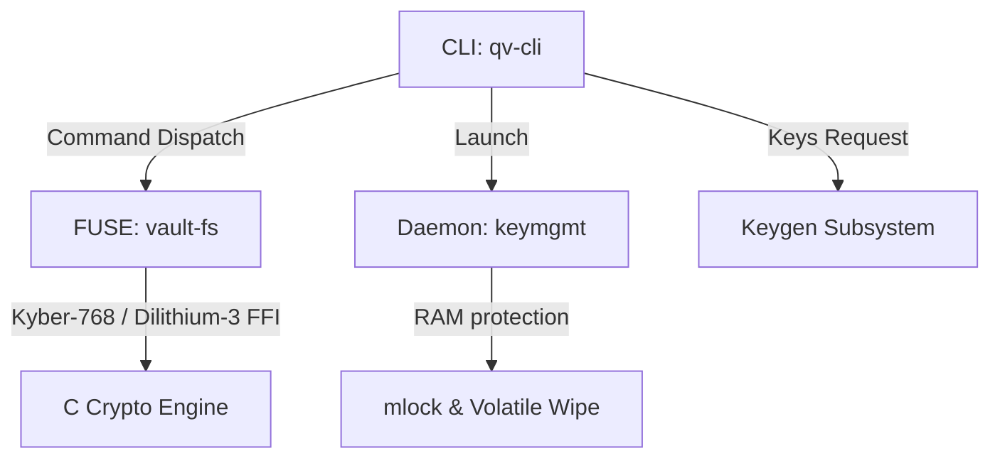

# QuantumVault End-to-End Integration Guide 🚀🔒

This document serves as the final integration walkthrough and user documentation for the complete **QuantumVault** post-quantum secure virtual filesystem suite.

---

## 1. System Architecture Overview

QuantumVault consists of four key components working together to protect sensitive files from both active tampering and theoretical future decryption by quantum computers:



1. **C Cryptography Engine (`crypto-engine`)**: Low-level crystal-grade primitives wrapper linking against `liboqs` for CRYSTALS-Kyber-768 and CRYSTALS-Dilithium-3.
2. **Virtual Filesystem Layer (`vault-fs`)**: FUSE implementation in Rust with transparent decapsulation, XOR stream decryption, signature checking, and directory hiding.
3. **Key Management Daemon (`keymgmt`)**: Background service utilizing `mlock` system calls to lock active credentials in RAM, preventing unencrypted swapping to disk, and volatile memory zeroing.
4. **CLI Wrapper (`qv-cli`)**: Unified entry command binary `qv` using `clap` subcommand parsing.

---

## 2. Step-by-Step System Walkthrough

Follow these steps to initialize and validate the entire integration sequence.

### Step 2.1: Key Generation (Credential Setup)
Use the unified CLI command to generate Kyber and Dilithium keypairs:

```bash
# Generate keys in a local output directory
qv keygen --out-dir ~/qv_credentials
```

**Expected Output**:
```text
Generating post-quantum credentials inside: /home/user/qv_credentials...
Generating Kyber-768 credential keypair...
Saved Kyber-768 credentials to Disk.
Generating Dilithium-3 signature keypair...
Saved Dilithium-3 credentials to Disk.
Key generation complete. All credentials initialized successfully.
```

**Verify the credentials files on disk**:
```bash
ls -la ~/qv_credentials
```
*Outputs: `kyber_public.key`, `kyber_secret.key`, `dilithium_public.key`, `dilithium_secret.key`.*

---

### Step 2.2: Starting the Key Management Daemon
Initialize the memory locked key security daemon:

```bash
qv run-daemon
```

**Expected Console Output**:
```text
Starting QuantumVault Key Management Daemon in background...
Successfully spawned key management daemon (PID: 12345).
```

*Note: In the background, `keymgmt` uses `libc::mlock` to keep active keys in physical memory pages, and securely wipes memory using `std::ptr::write_volatile` on exit.*

---

### Step 2.3: Mounting the Virtual Filesystem
Mount the post-quantum encrypted filesystem:

```bash
# Create necessary directory paths
mkdir -p ~/vault_backing_store
mkdir -p ~/quantum_mountpoint

# Mount filesystem via CLI command
qv mount --backend ~/vault_backing_store --mountpoint ~/quantum_mountpoint
```

**Expected Output**:
```text
Mounting QuantumVault FUSE filesystem in background...
Backend Store: /home/user/vault_backing_store
Mount Point: /home/user/quantum_mountpoint
Successfully spawned filesystem daemon in background (PID: 12348).
```

---

### Step 2.4: Writing and Reading Encrypted Files
Write data into the mount point:

```bash
echo "Top secret project parameters for mid review" > ~/quantum_mountpoint/secret_vault.txt
```

Verify that the file is instantly readable and decodes correctly through the mountpoint:
```bash
cat ~/quantum_mountpoint/secret_vault.txt
```
*Output: `Top secret project parameters for mid review`*

---

## 3. Security and Tamper Auditing

### 3.1 Inspecting Ciphertext and Signatures
Examine the raw files written to the backing store directory:

```bash
ls -la ~/vault_backing_store
```
*Outputs: `secret_vault.txt` (encrypted ciphertext) and `secret_vault.txt.sig` (Dilithium digital signature).*

Confirm that the backing file is encrypted (no plain text matches):
```bash
hexdump -C ~/vault_backing_store/secret_vault.txt
```

---

### 3.2 Auditing Tamper-Proofing (Signature Rejection)
Simulate a backing file corruption or an attacker injecting malicious payloads:

```bash
# Alter the signature file directly in backing store
printf '\x00' | dd of=~/vault_backing_store/secret_vault.txt.sig conv=notrunc bs=1 count=1

# Attempt to read the file through FUSE
cat ~/quantum_mountpoint/secret_vault.txt
```

**Expected Output**:
```text
cat: /home/user/quantum_mountpoint/secret_vault.txt: Input/output error
```
*The FUSE layer intercepted the read, detected the invalid CRYSTALS-Dilithium-3 signature, blocked decryption, and safely returned a system I/O Error (`EIO`), preventing any corrupted or tampered data leak.*

---

## 4. Clean System Shutdown

Unmount the virtual filesystem cleanly:

```bash
qv unmount --mountpoint ~/quantum_mountpoint
```

**Expected Output**:
```text
Attempting to unmount QuantumVault FUSE filesystem cleanly at: /home/user/quantum_mountpoint...
Clean unmount of FUSE mountpoint completed successfully.
```
